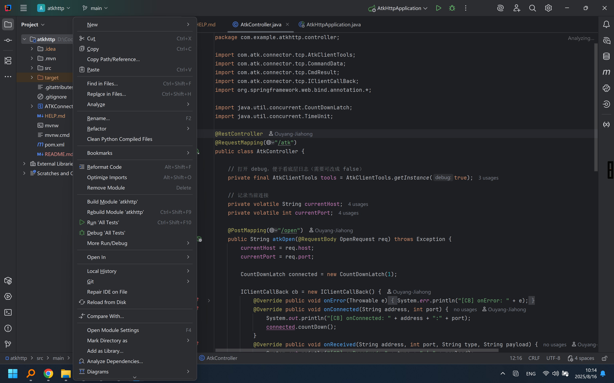
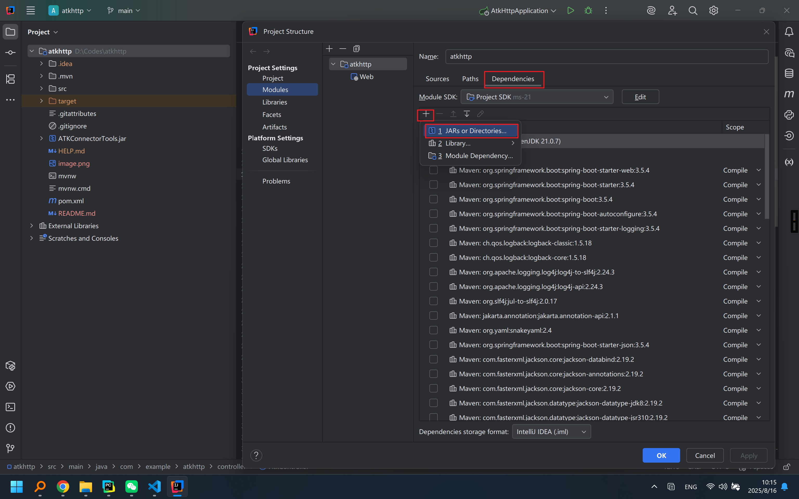
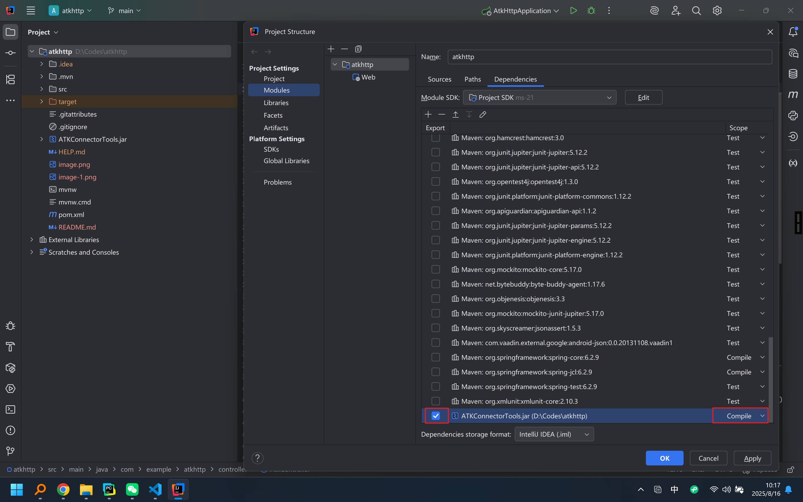
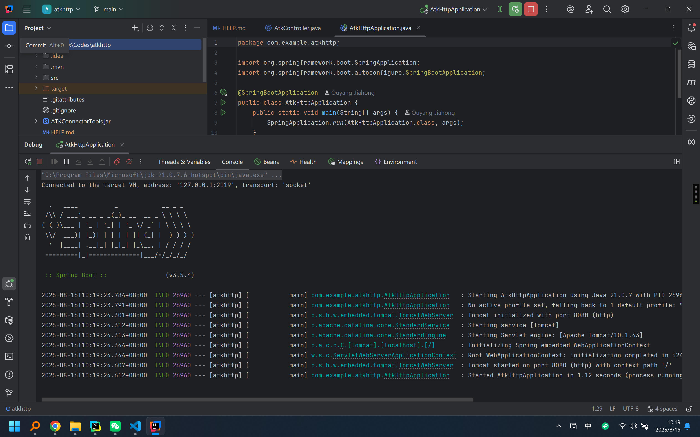

## 项目运行方式

建议使用idea打开本项目。在打开项目之后，右键项目名称，然后点击F4，打开项目依赖设置界面。如下图所示。

点入Dependancies界面，然后点击加号，加入JARs or Directories，选择我们加入到项目文件夹中的`ATKConnectorTools.jar`（ATK官方提供的Connect模式Java二次开发包）。

然后找到我们加入的开发包，点上勾，并且确保Scope是Compile模式，如下图所示：

然后编译运行程序即可，运行截图如下：

## 注意事项:

1. 本项目使用的Java JDK版本是21.0.7。我最后运行成功的版本是这个，用其他的可能不行，请注意。